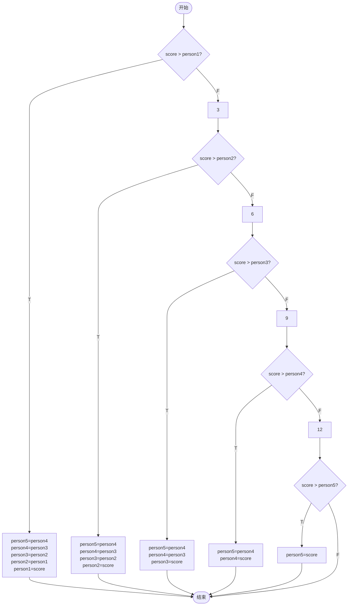

```mermaid
graph TD
    start([开始]) --> 1{score > person1?}
    
    1 -- T --> 2["person5=person4<br>person4=person3<br>person3=person2<br>person2=person1<br>person1=score"]
    1 -- F --> 3
    
    3 --> 4{score > person2?}
    
    4 -- T --> 5["person5=person4<br>person4=person3<br>person3=person2<br>person2=score"]
    4 -- F --> 6
    
    6 --> 7{score > person3?}
    
    7 -- T --> 8["person5=person4<br>person4=person3<br>person3=score"]
    7 -- F --> 9
    
    9 --> 10{score > person4?}
    
    10 -- T --> 11["person5=person4<br>person4=score"]
    10 -- F --> 12
    
    12 --> 13{score > person5?}
    
    13 -- T --> 14["person5=score"]
    13 -- F --> 15([结束])
    
    2 --> 15
    5 --> 15
    8 --> 15
    11 --> 15
    14 --> 15
```