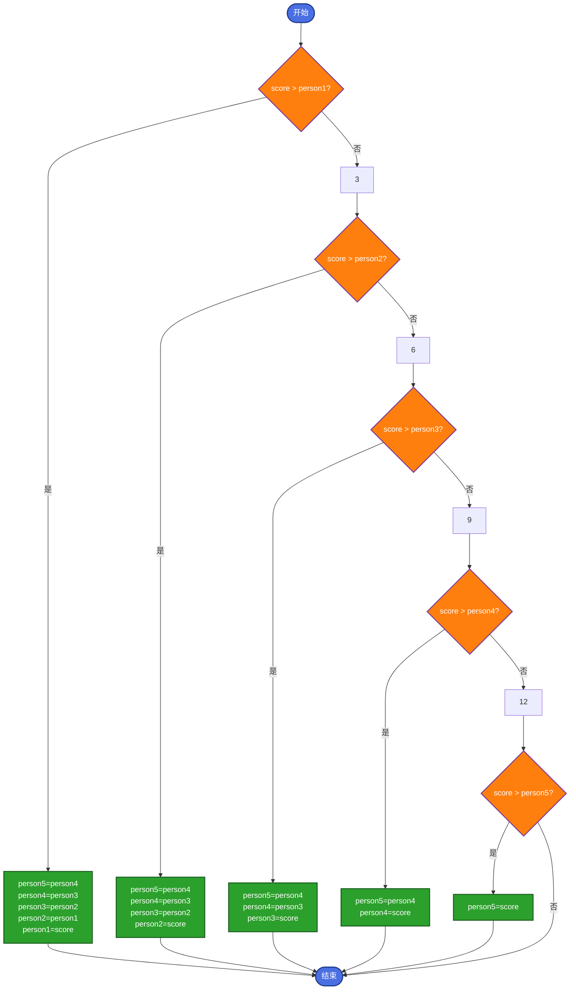

```mermaid
graph TD
    %% 定义全局样式
    classDef startEnd fill:#4a6fe3,stroke:#1e3a8a,stroke-width:2px,color:white;
    classDef decision fill:#ff7f0e,stroke:#7d3c98,stroke-width:2px,color:white;
    classDef process fill:#2ca02c,stroke:#1b5e20,stroke-width:2px,color:white;
    classDef inputOutput fill:#d62728,stroke:#880e4f,stroke-width:2px,color:white;

    %% 流程节点
    start([开始]):::startEnd --> 1{score > person1?}:::decision
    
    1 -- 是 --> 2["person5=person4<br>person4=person3<br>person3=person2<br>person2=person1<br>person1=score"]:::process
    1 -- 否 --> 3
    
    3 --> 4{score > person2?}:::decision
    
    4 -- 是 --> 5["person5=person4<br>person4=person3<br>person3=person2<br>person2=score"]:::process
    4 -- 否 --> 6
    
    6 --> 7{score > person3?}:::decision
    
    7 -- 是 --> 8["person5=person4<br>person4=person3<br>person3=score"]:::process
    7 -- 否 --> 9
    
    9 --> 10{score > person4?}:::decision
    
    10 -- 是 --> 11["person5=person4<br>person4=score"]:::process
    10 -- 否 --> 12
    
    12 --> 13{score > person5?}:::decision
    
    13 -- 是 --> 14["person5=score"]:::process
    13 -- 否 --> 15([结束]):::startEnd
    
    %% 连接所有流程到结束节点
    2 --> 15
    5 --> 15
    8 --> 15
    11 --> 15
    14 --> 15
```