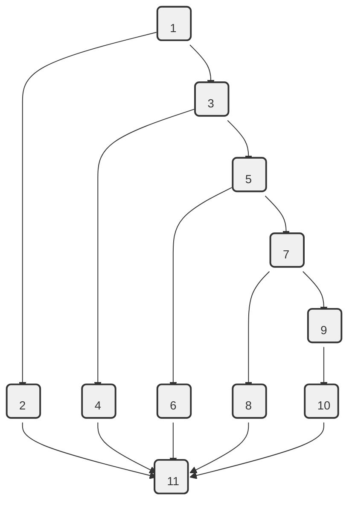

```mermaid
graph TD
    %% 定义节点样式
    classDef nodeStyle fill:#f0f0f0,stroke:#333,stroke-width:2px,font-size:14px,width:40px,height:40px;
    
    %% 节点定义
    1(1):::nodeStyle
    2(2):::nodeStyle
    3(3):::nodeStyle
    4(4):::nodeStyle
    5(5):::nodeStyle
    6(6):::nodeStyle
    7(7):::nodeStyle
    8(8):::nodeStyle
    9(9):::nodeStyle
    10(10):::nodeStyle
    11(11):::nodeStyle
    
    %% 流程连接
    1 --> 2
    1 --> 3
    3 --> 4
    3 --> 5
    5 --> 6
    5 --> 7
    7 --> 8
    7 --> 9
    9 --> 10
    10 --> 11
    2 --> 11
    4 --> 11
    6 --> 11
    8 --> 11
```