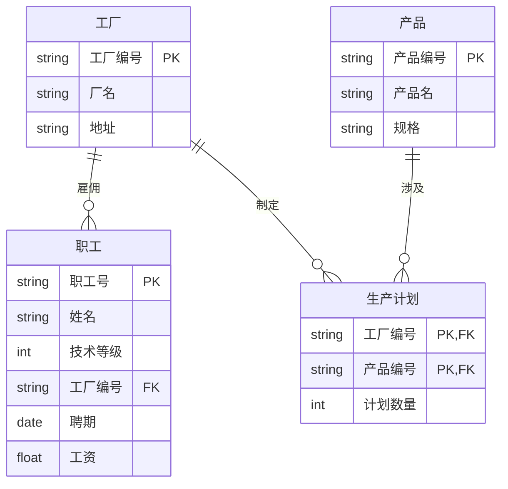

```mermaid
erDiagram
    工厂 {
        string 工厂编号 PK
        string 厂名
        string 地址
    }
    产品 {
        string 产品编号 PK
        string 产品名
        string 规格
    }
    职工 {
        string 职工号 PK
        string 姓名
        int 技术等级
        string 工厂编号 FK
        date 聘期
        float 工资
    }
    生产计划 {
        string 工厂编号 PK,FK
        string 产品编号 PK,FK
        int 计划数量
    }
    工厂 ||--o{ 职工 : 雇佣
    工厂 ||--o{ 生产计划 : 制定
    产品 ||--o{ 生产计划 : 涉及
```